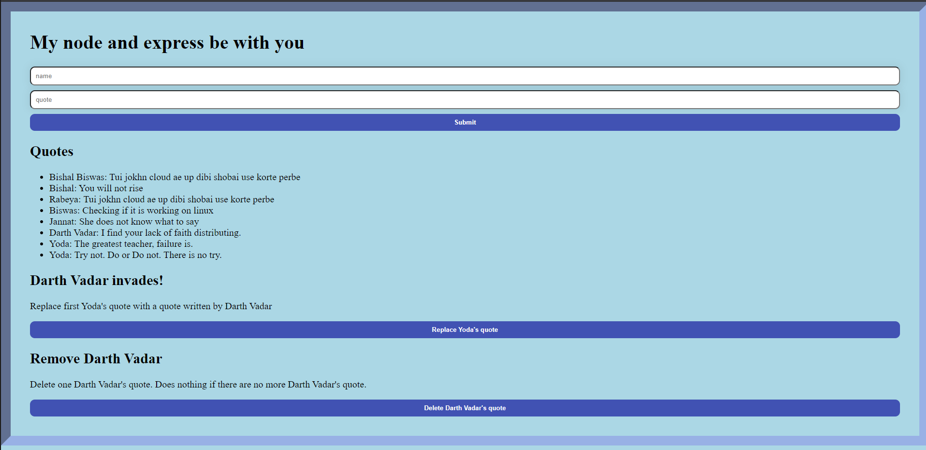

# Star_Qoutes_L
CRUD based application Implemented with Node.js and express framework. Uses MongoDB for storing data. The application is running on EC2 instance of AWS. 
I had fun biulding this and learned a lot of things.

### About the application. 
It is an online form based application 24/7 running as of now. It collects different qoutes of Star war characters from user input and store them in the database for any other process. 
But it is not restricted to only star wars character. It was an inspiration behind building it. But anyone can add a qoute with any name or any qoute. A qoute can be replaced or even delete. 
Right now you can only replace Yoda's qoute with Darth Vadar's and delete Darth Vadar qoutes. I mean it is just an implementation. 

* Here is snapshot of what it looks like. 
 
